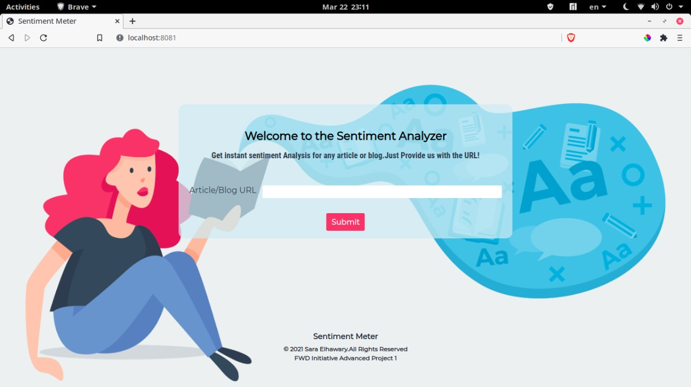

## Table of contents

- [General info](#general-info)
- [Technologies](#technologies)
- [Credits](#credits)

## General info

This project is the first project in FWD Egypt initiative with Udacity in Advanced Web Development. It is a Sentiment Analyzer for performing a detailed multilingual sentiment analysis of texts from different sources.

The text provided is analyzed to determine if it expresses a positive/negative/neutral sentiment; to do this, the local polarity of the different sentences in the text is identified and the relationship between them evaluated, resulting in a global polarity value for the whole text.

Besides polarity at sentence and global level, Sentiment Analysis uses advanced natural language processing techniques to also detect the polarity associated to both entities and concepts in the text. It provides a reference in the relevant sentence and a list of elements detected with the aggregated polarity derived from all their appearances, also taking into account the grammatical structures in which they are contained.

## Technologies

Project is created with:

- Webpack: 5.27.1

## Credits

Many thanks to Mr/Mohammed El-zanaty our course session Lead.
